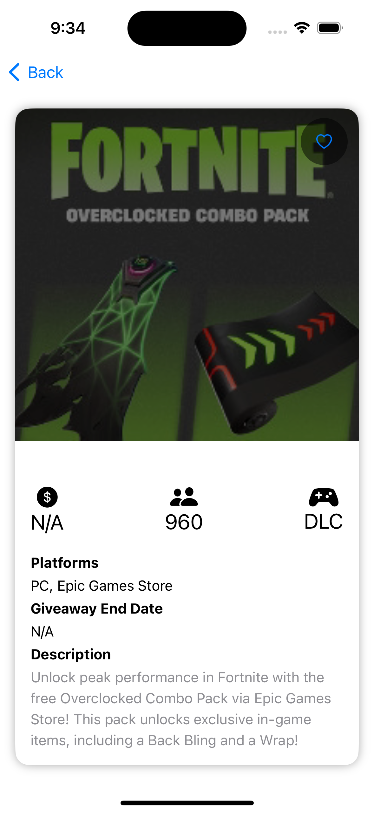

# Before starting
- This demo was implemented using version [1.10.4](https://pointfreeco.github.io/swift-composable-architecture/main/tutorials/meetcomposablearchitecture) of TCA.
- Written using SWiftUI.
- Compatable by devices with iOS 14.0 and upper.
- I have plans to continue working on this demo to make it more stable and works in more effecient way specially in [Testing] & [Routing] & [Alamofire with Moya] & [Dark-Light Mode] as i will continue practice of how to make this in a proper way.

# Install
* Clone and if any error appears related to Package Dependencies Right click on **Package Dependencies** section in the left side bar and click on **Resolve Package Versions**

# App Structure

* App structure I use **TCA**.

Here's an example of how most of app coded with TCA:
struct that will represent the domain of the feature. This struct must conform `ReducerProtocol` protocol and providing `State` struct, `Action` enum and `reduce` method.

```swift
struct CounterDomain: ReducerProtocol {
    struct State {
        // State of the feature
    }

    enum Action {
        // actions that use can do in the app
    }
    
    func reduce(into state: inout State, action: Action) -> EffectTask<Action> {
        // Method that will mutate the state given an action.
    }
}
```

* I created Extension for UIImageView to download the image from the link, also most of app componets is separated to be used in other places of code so we can reuse it in an easy way without rewriting code.

* I create UI with code [SwiftUI].

* I used **SPM** (Swift Package Manager).

## Screenshots
### Giveaways
||

### Giveaway Details



## Things should be done if more time

- Animations for carousl view with Geometry Reader or more effective way.
- More Unit test cases.
- User SnapshotTests.
- Use [SwiftLint](https://github.com/realm/SwiftLint) to enhance Swift style.
- Use [Alamofire].

## Info

Name: Ahmed Elsman

Email: ahmedelsman0@gmail.com

Thanks Hope to hear about you soon.
